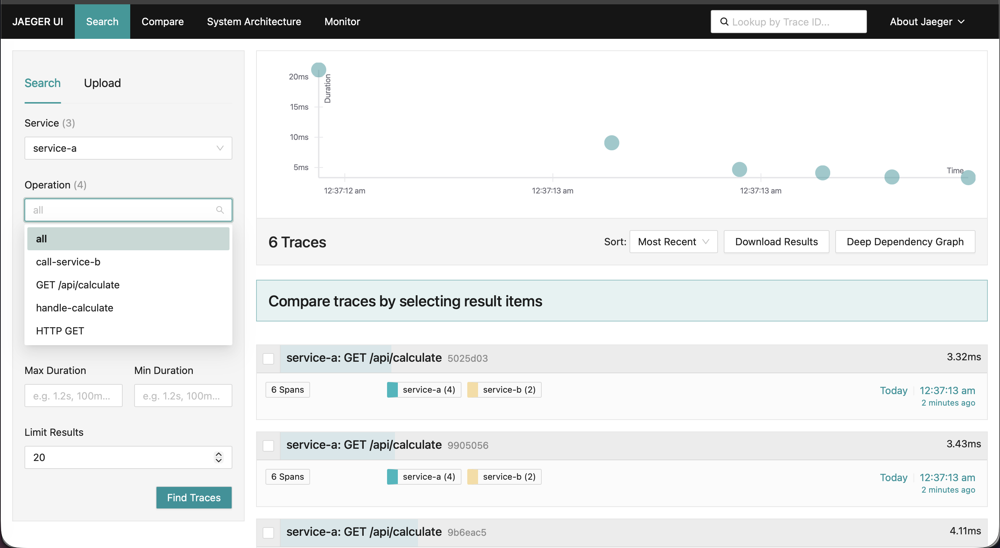
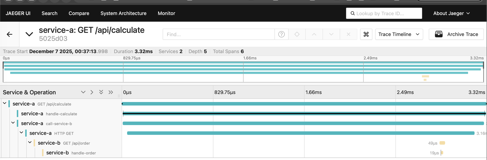

# Архитектурное решение по трейсингу

## Системы для покрытия трейсингом

Трейсинг обязателен для всех компонентов, участвующих в процессе обработки заказа — от INITIATED до CLOSED, включая передачу через очередь и S3:

1. **InternetShop**: Первая точка создания заказа (`INITIATED`, `FILE_UPLOADED`, `SUBMITTED`). Без фронтенд-трейса не видно что происходило с заказом до API. Особенно важно: загрузка 3D-файла в S3 и отправка `SUBMITTED`.

2. **Shop API**: Обрабатывает `SUBMITTED` - создаёт заказ в Shop DB. Критичная точка создания заказа в системе.

3. **B2B API**: Аналогично **Shop API**, но для внешних партнёров — выше риск некорректных данных/форматов.

4. **CRM API**: Центральный хаб приёма заказа и подтверждения заказа, отправка в RabbitMQ для MES. Точка согласования и интеграции.

5. **RabbitMQ**: Не система как таковая, но обязательно включить в трейс: заголовки сообщений (`trace_id`, `span_id`), dead-letter routing. Иначе есть риск получения разрыва цепочки.

6. **MES API**: Выполняет `PRICE_CALCULATED` — самый рискованный этап: тяжёлые расчёты, возможны таймауты, ошибки валидации 3D-файла.

7. **MES**: Важны только backend-вызовы из UI: переход из `MANUFACTURING_APPROVED` в `MANUFACTURING_STARTED` и далее. Не нужно трейсить UI-рендер — только API-запросы по смене статуса.

8. **CRM**: Только вызовы изменения статусов `MANUFACTURING_APPROVED` и `CLOSED`.

9. **S3**: Сам S3 не трейсится, но все операции с файлами (загрузка 3D-модели, чтение для расчёта) должны нести `trace_id` в metadata.

10. **БД**: Трейсинг БД — через span в приложении (SQL-запросы как child-spans), а не через отдельный экспортер.

## Данные, которые должны попадать в трейс

Для каждого span (действия в системе) необходимо обеспечить минимальный набор атрибутов по стандарту OpenTelemetry, плюс бизнес-контекст.

### Обязательные технические атрибуты (везде)

```
    trace_id: <uuid>
    span_id: <uuid>
    parent_span_id: <uuid>
    service.name: shop-api | crm-ui | mes-api | ...
    service.version: 1.4.2
    deployment.environment: prod | stage
    http.method: POST
    http.url: /api/v1/orders
    http.status_code: 201
    error: true/false
    exception.message: "Invalid STL file"
    exception.stacktrace: "..."
```

### Бизнес-атрибуты (должны передаваться сквозь все системы)

```
- order.id: 12345                                     # Сквозной идентификатор заказа в системе
- order.status.from: SUBMITTED                        # Анализ предыдущей точки останова статуса заказа
- order.status.to: PRICE_CALCULATED                   # Валидация бизнес поцесса и последовательности изменения статусов
- user.id: USR-789                                    # Для анализа проблем по конкретным пользователям
- user.role: customer / seller / operator / partner   # Сегментация запросов по ролям пользователя
- file.model.type: stl / step / obj                   # Диагностика ошибок расчёта по форматам файлов
- file.model.size_bytes: 2457600                      # Корреляция с размерами файлов
- partner.id: 3453143                                 # Только для B2B API — выявление пробоемных интеграций
```

### Специфичные атрибуты по системам

| Система | Дополнительные атрибуты|
|--|--|
| InternetShop | cart.items_count, constructor.used: true/false, upload.duration_ms |
| Shop API / B2B API | validation.errors: ["missing_address"], rate_limit.remaining: 98 |
| CRM API | db.lock_wait_ms: 120, rabbitmq.routing_key: order.created.v2 |
| RabbitMQ (в span’ах) | message.id, exchange, queue, redelivered: true, x-death.reason |
| MES API | calculation.duration_ms, complexity.score: 8.7, cache.hit: false, materials.count: 3 |
| MES / CRM (UI) | ui.page: order_details, ui.button: approve_manufacturing, network.rtt_ms: 85 |

## Мотивация

Внедрение распределённого трейсинга в вашу систему — это не просто отладочный инструмент для разработчиков, а стратегическая инвестиция в управляемость, надёжность и прозрачность сквозных бизнес-процессов. Особенно в архитектуре с большим количеством компонентов, асинхронной интеграцией через RabbitMQ и критичной зависимостью от точной последовательности статусов заказа.

Трейсинг приводит к прозрачности процессов обработки ситсемы, где:

- каждый заказ — отслеживаемая единица работы,
- каждая ошибка — измеримый сигнал для улучшения,
- каждый этап — точка контроля и оптимизации.

### Зачем нужен трейсинг?

1. Система — распределённая, но бизнес-процесс — сквозной
Заказ проходит через множество сервисов и без трейсинга нельзя ответить на простые вопросы вида: "Почему заказ 789 стоит 12 часов в статусе PRICE_CALCULATED?". Для этого придётся вручную листать логи в нескольких сервисах, сопоставлять временные метки, и предполагать "что же могло пойти не так".

2. Риски потери заказа и простоев производства
Ошибка на границе интеграций. Например, ошибка в интеграции между сервисами CRM и MES (например, сообщение ушло в DLQ) приведёт к потере заказа и операторы его не увидят. Трейсинг позволяет быстро обнаружить разрыв, определить где он произошёл и найти необходимые логи в месте разрыва, а не просматривать все логи всех сервисов.

3. Нет выделенного SRE — нужна автоматизированная диагностика
При нехватке специалистов SRE — трейсинг может значительно облегчить и сократить время разбора инцидентов.

### Технические и бизнес-метрики, которые улучшит трейсинг

1. MTTR (Mean Time To Resolve) инцидентов по заказам;
2. Процент "потерянных" или зависших заказов;
3. Доля заказов с проблемами;
4. Среднее время согласования заказа (переход из статуса `PRICE_CALCULATED` в статус `MANUFACTURING_APPROVED`).

### Бизнес-воздействие

1. **Операционная эффективность: **Сокращение простоев производства за счёт быстрой диагностики зависаний обработки заказов.
2. **Повышение конверсии:** 3D-конструктор и загрузка файлов — ключевые этапы; трейсинг покажет, где пользователи сталкиваются с ошибками.
3. **Управление партнёрскими интеграциями:** Для B2B есть возможность объективной оценки качества интеграции партнёров (ошибки формата, таймауты).
4. **Доверие к ИТ:** Возможность давать точные SLA (например, "расчёт цены — не дольше 30 с в 99% случаев") и доказывать их выполнение через трейсы.

## Предлагаемое решение

Для отслеживания всего жизненного цикла заказа необходимо внедрить централизованную систему трейсинга заказов, которая будет фиксировать изменения всех статусов, логировать события. Для достижения этих целей предлагается использовать следующие инструменты:

1. OpenTelemetry — это фреймворк для сбора:

   - Traces (трейсы — цепочки вызовов),
   - Metrics (метрики — нагрузка, задержки),
   - Logs (логи — сообщения от сервисов).

   Он работает в разных языках и средах, что идеально подходит для системы (Java, C#, TypeScript).

2. Внедрение OpenTelemetry в каждом сервисе: подключаются библиотеки и компоненты для работы с OpenTelemetry в сервисах; реализуется отправка трассировки; реализуется поддержка trace_id во входящих запросах, добавление span_id для вложенных запросов и расчётов.

3. Разворачивание OpenTelemetry Collector

    OpenTelemetry Collector — центральный агрегатор: приём, обработка и маршрутизация данных от всех сервисов.

4. Разворачивание Jaeger - визуализация трейсов

    Jaeger — это система, которая:

    - Хранит трейсы;
    - Позволяет искать по `traceId`, `service`, `tags`;
    - Отображает дерево спанов (какой сервис что вызвал и сколько времени заняло).

5. Разворачивание Loki / Grafana

    Для хранения логов разворачивается Loki, а для их визуализации - Grafana.

6. Интеграция с логами (Loki / ELK)

    Чтобы обеспечить связь логов с тейсами необходимо внести изменение в логирование сервисов. Все сервисы должны логировать `traceId`:

    ```JSON
    {
        "level": "INFO",
        "msg": "Order status changed",
        "orderId": "123",
        "traceId": "abc123xyz",
        "service": "CRM-API"
    }
    ```

    Во время расследования инцидентов можно в Grafana найти логи обработки по `orderId`, из лога скорпировать `traceId` и посмотреть полный трейсинг обработки заказа в Jeager.

Предлагаемая схема изменения архитектуры системы:
- [jewerly_c4_model.drawio](./jewerly_c4_model.drawio)
- [jewerly_c4_model.png](./jewerly_c4_model.png)

## Компромисы

Внедрение трейсинга — мощный инструмент, но архитектуре есть зоны, где его применение либо бессмысленно, либо экономически/технически нецелесообразно.

### Внешние партнёры в B2B API

Для B2B API генерировать новый трейс при приёме запроса, но сохранять возможность передачи `trace_id` как артибут запроса. Давать партнёрам инструкции при интеграции как правильно передавать трассировку запросов (как опция). 

| Проблема | Обоснование компромисса  |
|--|--|
| Нет передачи `traceparent` | Партнёр может не поддерживать W3C Trace Context — отправляет "голый" JSON без заголовков. |
| Невозможность доработки | Нет контроля над кодом партнёров. Требовать изменения на стороне партнёра - долго, дорого или вообще невозможно. |
| Риск фрагментации трейса | Генерация trace_id происходит в B2B API и есть риск прерывания трассировки. |

### S3-хранилище

Не реализовывать трейсинг на стороне S3-хранилища, а добавить в код сервисов, работающих с S3, явный span вокруг методов вызова S3. 

| Проблема | Обоснование компромисса  |
|--|--|
| Нет span’ов внутри S3 | Можно передать `trace_id` в metadata, но сам S3 не создаёт span’ов и невозможно отследить операции на стороне S3. |
| Ограниченная диагностика | При ошибке 503 SlowDown будет виден только факт, но не причина сбоя. |
| Стоимость более глубокого трейсинга | Для подробного и управляемого трейсинга S3 нужен кастомный прокси, но это плюс ещё один компонент, повышение нагрузки, и ещё одна точка отказа. |

### UI-рендер и клиентская аналитика

Трейсить на стороне UI только бизнес-события, связанных с обработкой заказа.

| Проблема | Обоснование компромисса  |
|--|--|
| Высокий overhead в браузере | Трейсинг каждого клика и рендара - это рост CPU, потребление памяти, трафика. Особенно критично для пользователей с 3D-конструктором. |
| Низкая детерминированность | JS-ошибки, блокировки рекламой, медленный интернет — искажают чистоту трейса. |
| Почти нулевая бизнес-ценность | Знание длительности рендеринга UI-элемента не помогает выявить потерю заказа. |

### Тяжеловесные расчёты в MES API

Для тяжёлых расчётов отключить детализацию span`ов внутри расчётных функций, а трейсить только вход/выход. Использовать асинхронную отправку трейсов (batch, background thread).

| Проблема | Обоснование компромисса |
|--|--|
| Overhead трейсинга в CPU-нагруженных расчётах | Включение span’ов и сериализации OTLP в расчётном цикле ведёт к дополнительной нагрузке на CPU, что может вывести систему за лимит при пиковой нагрузке. |
| Риск усугубления таймаутов | Если расчёт на грани тайм-аута, то +500 мс на трейсинг может привести к увеличению ошибок 504. |
|  |  |

## Безопасность

При работе с заказами, 3D-моделями и интеграции с партнёрами важно использовать комплексный подход к безопасности: защита данных, предотвращение утечек, соответствие принципу минимальных привилегий.

Трейсинг — это не просто отладочная информация. В span’ах могут содержаться:

- `order.id`, `user.id`, `partner.id` — PII (персональные/идентифицирующие данные),
- фрагменты payload’ов (например, параметры расчёта стоимости),
- внутренние URL, имена баз, топологии инфраструктуры — опасная информация для злоумышленника.

### Защита на уровне передачи данных

| Компонент | Мера | Обоснование |
|--|--|--|
| OTLP-трафик | TLS 1.3 (mTLS опционально) | Предотвращение MITM, сниффинга трейсов в сети. |
| Grafana / Jeager (UI) | HTTPS + HSTS, запрет HTTP | Обязательно для любого публичного или внутреннего web-интерфейса. |
| Loki | TLS, внутренний сетевой сегмент (VPC/NSG) | Loki не должен быть доступен извне; только Collector и Grafana — по белым IP/MAC. |

### Аутентификация и авторизация

| Требование | Релазиация |
|--|--|
| Только сотрудники компании | Интеграция с корпоративным IdP: LDAP/AD или Keycloak. |
| Разделение по ролям (RBAC) | Настройка групп доступа на основании RBAC в Grafana и Jeager |

### Анонимизация и фильтрация чувствительных данных

| Компонент | Мера |
|--|--|
| HTTP-заголовки | Удаление `Authorization`, `Cookie`, `X-API-Key` |
| HTTP-тела (request/response) | Запрет авто-сбора тел по умолчанию. Только при критических ошибках и с маскировкой. |
| Бизнес-атрибуты | Маскировка PII: `user.id`, `order.id` |
| Логи в span’ах | Запрет включения log.message в трейсы (только при критических ошибках) |

### Защита на уровне инфраструктуры

| Компонент | Мера |
|--|--|
| Сетевой уровень | Изоляция компонентов observability в отдельном namespace (k8s), vpc |
| Хранилище | Jaeger (для трейсов) и Loki (для логов) обеспечивают шифрование at rest через backend-хранилища: LUKS на уровне дисков хостов (EBS/GCE PD) или AWS KMS/SSE-KMS для S3-объектов с указанием kms_key_id. |
| Аудит | Включение аудитных логов в Grafana/Jeager (кто, когда, что искал). Интеграция с SIEM. |

### Соответствие регламентам и стандартам

| Требование | Реализация в трейсинге |
|--|--|
| Внутренний регламент по защите PII | Все span’ы проходят через `sensitive-data-filter` в Collector. Проводится регулярный аудит (например, скрипт проверяет, нет ли email в атрибутах). |
| Требования к код-ревью | В чек-листе ревью есть пункты с проверками PII. Например: "Проверить, нет ли логов/атрибутов с PII в новых span’ах" |
| Изменения в change log | Любое изменение в конфигурации Collector/Jeager — фиксируется в change log с указанием изменений |

## Автоматический мониторинг сквозного процесса заказа и алертинг на основе трейсинга

Ключевой идеей решения является превратить трейсы в метрики, на основании которых настроить автоматический алертинг. Целью решения является превратить трейсы из инструмента отладки в систему проактивного управления бизнес-процессом, где любое отклонение от ожидаемого workflow заказа обнаруживается автоматически — без участия человека.

Описание архитектуры решения:

- [jewerly_c4_model_alert.drawio](./jewerly_c4_model_alert.drawio)
- [jewerly_c4_model_alert.png](./jewerly_c4_model_alert.png)

Основные этапы реализации:

1. Генерация бизнес-метрик из трейсов (Prometheus)

    OpenTelemetry Collector с помощью spanmetrics processor преобразует span’ы в агрегированные метрики. Collector собирает трейсы, преобразует спаны в метрики и экспортирует их.

    Пример получаемых метрик:

    | Метрика | Описание | Использование |
    |--|--|--|
    | `span_status_order_count{status="PRICE_CALCULATED", service="mes-api"}` | Сколько заказов достигло статуса | Отслеживание тренда - с ростом растёт и нагрузка на сервис |
    | `span_duration_order_seconds{status_from="SUBMITTED", status_to="PRICE_CALCULATED"}` | Время прохождения заказа от `SUBMITTED` к `PRICE_CALCULATED` | Отслеживание SLO |
    | `span_error_order_count{status="PRICE_CALCULATED"}` | Ошибки на этапе расчёта | Алертинг при большом пороге ошибок |

2. Настройка сбора в Prometheus

    Настройка сбора метрик в Prometheus из эндпойнта Collector (порт 8889).


3. Настройка алертинга Prometheus + Alertmanager

    Настройка уведомлений в Alertmanager на основе собранных метрик


## Трейсинг с OpenTelemetry и Jaeger

Поиск трейсов `service-a`


Просмотр трейса `service-a`

