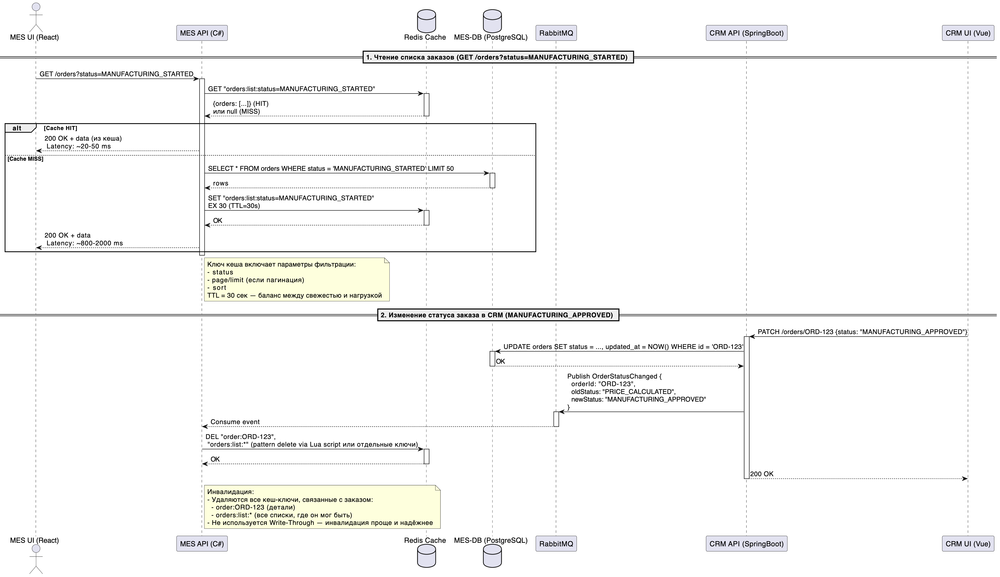

# Архитектурное решение по кешированию

## Мотивация

В настоящее время система испытывает две ключевые проблемы:

- Долгие расчёты стоимости заказа в MES (2–30 мин) — это критический узкое место для клиентского опыта: пользователи не получают обратной связи сразу после оформления заказа, а отложенный расчёт приводит к задержкам и возможным потерям продаж.
- Низкая производительность UI MES — операторы жалуются на медленную работу интерфейса, особенно при открытии/редактировании заказов с большими 3D-файлами или большим объёмом метаданных (например, истории статусов, расчётов и т.д.).

Оба симптома указывают на повышенную нагрузку на MES API и MES-DB:

- Высокочастотные тяжёлые расчёты (на C#) используют CPU и, возможно, I/O.
- UI MES выполняет частые и объёмные запросы к API и БД — особенно при отображении списка заказов или истории.

**Цели кеширования:**

- Сократить время получения цены для клиента после отправки заказа (SUBMITTED -> PRICE_CALCULATED).
- Ускорить реакцию UI MES при работе с заказами (просмотр, фильтрация, детализация).
- Снизить нагрузку на MES API и MES-DB, чтобы система масштабировалась при росте заказов.

**Что предлагается закешировать:**

- Результаты расчётов стоимости заказов (по уникальным параметрам модели и конфигурации — model_hash, material_id, volume_mm3, surface_area, и т.п.), а так же результаты промежуточных расчётов (которые используются для расчёта разных моделей).
- Метаданные заказов и справочников, часто запрашиваемые UI MES:
  - Статусы заказов (особенно история переходов),
  - Параметры материалов/технологий,
  - Списки заказов с агрегированными полями (не сырые файлы, а id, status, customer, price, created_at и т.п.).
- Результаты агрегаций/отчётов (например, количество заказов по статусам, среднее время на стадии и т.д.), если они используются в дашбордах.

## Предлагаемое решение

### Тип кеширования: серверное (на уровне API)

- Клиентское кеширование (в браузере или приложении MES) не решает проблему расчёта стоимости и не снижает нагрузку на сервер. Оно может помочь немного с UI, но уязвимо при обновлении данных и не подходит для shared-информации (например, дашборды руководства).
- Серверное кеширование — прямое влияние на latency и нагрузку. MES API и CRM API — естественные точки внедрения.

### Выбор паттерна: Cache-Aside (Lazy Loading)

- При запросе - сначала читаем из кеша.
- При отсутствии — читаем из БД/производим расчёт -> кладём в кеш.
- При изменении — инвалидируем соответствующие ключи кеша (не обновляем напрямую, чтобы избежать сложности с атомарностью и race conditions).

### Обоснование выбора

**Cache-Aside:**

  - Прост в реализации,
  - Сохраняет consistency при инвалидации,
  - Позволяет кешировать результаты расчётов (не только БД),
  - Гибкое TTL-управление

**Write-Through:**

  - Гарантирует синхронность кеша и БД

*Но не подходит потому что:*

  - Требует обновления кеша при каждой записи, даже если данные редко читаются, что избыточно для редких операций;
  - Не подходит для тяжёлых расчётов (кеш обновляется до ответа клиенту — задерживает response).

**Refresh-Ahead:**

  - Предотвращает cache miss для "горячих" данных.

*Но не подходит потому что:*

  - Требует прогнозирования запросов
  - Невозможно для расчётов: невозможно предугадать, какой именно model_hash+material будет запрошен
  - Высокий overhead на background-refresh

### Особенности для расчётов

Для PRICE_CALCULATED предлагается асинхронный кеш с TTL:

1. Пользователь нажимает "Сделать заказ" - заказ создаётся в CRM API и статус изменяется на `SUBMITTED`.
2. MES получает задачу через RabbitMQ -> начинает расчёт в фоне.
3. MES API отвечает на `/price?order_id=`:
     - если цена уже посчитана - сразу отдаёт (из RAM или Redis),
     - если расчёт в процессе - возвращает 202 Accepted + status: PENDING,
     - если цена уже известна для идентичной конфигурации - возвращает закешированное значение.
4. В процессе расчёта промежуточные результаты так же кэшируются с использованием ключей `value:{model_hash}:{material_id}:{technology_id}:{value_id}`
5. Как только расчёт завершён — результат сохраняется в кеш по ключу:
`price:{model_hash}:{material_id}:{technology_id}:{tolerance}` + `order:{order_id}` (для историчности).
TTL: 7–30 дней (в зависимости от частоты обновления цен на материалы/технологии).

Такой подход позволяет:

- Сократить время вторичных расчётов для схожих заказов с ~10 мин до ~10 мс.
- Сократить время расчёта за счёт использования уже готовых промежуточных данных.
- Уменьшить нагрузку на CPU (расчёт — только для новых уникальных конфигураций).
- Сохранить точность (кешируется по хешу модели, а не по `order_id` — защита от дублей).

### Технология кеширования 

Для реализации цеширования предполагается использовать Redis (Yandex Managed Service for Redis) — в том же регионе, что и MES-EC2 и MES-DB. Redis обеспечивает поддержку TTL, atomic operations, pub/sub для инвалидации. Легко масштабируется при росте кеша.

## Sequence Diagram: Кеширование в MES

| Сущность | Роль в кешировании |
|--|--|
| MES UI (React) | Инициирует запросы к API. Не кеширует самостоятельно (серверное кеширование). |
| MES API (C#) | Основная точка интеграции кеша: реализует паттерн Cache-Aside. Управляет чтением/записью в Redis, обрабатывает события инвалидации. |
| Redis Cache | Хранит:   - `order:{id}` — детали заказа (TTL 60–120 с),  - `orders:list:{filters}` — списки (TTL 20–60 с),  - `price:{hash}` — расчёты (TTL 7+ дней). |
| MES-DB (PostgreSQL) | Источник истины. Запросы к ней идут только при cache miss или записи. |
| RabbitMQ | Транспорт для событий кросс-системной инвалидации (CRM <> MES). Гарантирует eventual consistency. |
| CRM API (SpringBoot) | Публикует события при изменении заказов. Не читает кеш MES, но инициирует его обновление. |

## Стратегия инвалидации кеша

Для обеспечения актуальности данных и баланса между производительностью и согласованностью предлагается гибридная стратегия инвалидации, включающая:

| Тип данных | Стратегия инвалидации | Обоснование |
|--|--|--|
| Детали заказа (`order:{id}`) | Программная (event-driven) инвалидация по ключу | Изменения инициируются явно (из CRM или MES), инициируют публикацию события, что ведёт к инвалидации кеша в Redis. Гарантирует eventual consistency без избыточного TTL. |
| Списки заказов (`orders:list:*`) | Комбинированная: программная инвалидация + короткий TTL | Программная инвалидация при значимых изменениях (статус, назначение оператора), но с fallback через TTL (20–60 с), чтобы избежать застревания устаревших данных при потере события. |
| Результаты расчётов (`price:{hash}`) | Временная (TTL) + условная программная | TTL = 7–30 дней (в зависимости от стабильности цен на материалы/технологии). Дополнительно: при обновлении справочников (`material`, `technology`) — инвалидация всех `price:*` через фоновую задачу (например, по расписанию или событию CatalogUpdated). |

**Почему другие стратегии не подходят:**

- **Чисто временная (TTL):** Неприемлема для оперативных данных (статусы заказов): 30-секундная задержка = операторы работают со старыми данными, что ведёт к ошибкам и дублям.
- **Lazy invalidation (по чтению):** первый пользователь после изменения "платит" за latency обновления. Недопустимо для UI операторов.
- **Write-Through:** увеличивает latency каждой операции записи (например, PATCH /orders ведёт к обновлению БД + Redis). MES-EC2 и так перегружен — это усугубит проблему.
- **Refresh-Ahead (pre-warming):** требует прогнозирования. Невозможно предсказать, какой статус будет изменён следующим, или какая модель будет загружена. Энергозатратно и малоэффективно.

## Варианты решения

В связи с тем, что MES — критически нагруженный компонент с разнородными рабочими нагрузками (тяжёлые расчёты + интерактивный UI), существует два принципиально разных пути оптимизации через кеширование:

| Критерий | Решение 1: Централизованное кеширование в MES API  (Cache-Aside + Инвалидация по событию) | Решение 2: Декомпозиция: вынос расчётов в отдельный Calculation Service с внутренним кешированием |
|--|--|--|
| Описание | Все механизмы кеширования внедряются в существующий MES API (C#). Кеш хранится в Redis. Инвалидация — через события RabbitMQ от CRM и MES. | MES API становится "тонким" — отвечает только за оркестрацию. Расчёт стоимости выносится в новый Calculation Service, который управляет своим кешем (внутренним или Redis), включая идемпотентные задачи и фоновую предобработку. |
| Диаграмма (упрощённо) | MES UI -> MES API <-> Redis <-> MES-DB   Инвалидация: CRM API -> RabbitMQ -> MES API -> DEL Redis | MES UI -> MES API -> Calculation Service <-> Redis/Internal Cache   MES API <-> MES-DB   Инвалидация: Calc Service сам управляет TTL и ключами;   CRM -> RabbitMQ -> Calc Service (для сброса справочников) |
| Плюсы | - Быстро внедряемо: изменения только в существующем MES API.  - Минимальные архитектурные изменения.  - Единая точка контроля кеша (легко мониторить hit rate, логировать).  - Не требует изменений в CI/CD и деплой-процессах. | - Изоляция нагрузки: расчёты не блокируют MES API — UI остаётся отзывчивым даже при пиковых расчётах.  - Гибкое масштабирование: Calculation Service можно масштабировать отдельно.  - Возможность добавить batch- и pre-calculation (например, ночная прогонка популярных моделей).  - Поддержка долгих операций через async polling. |
| Минусы | - MES API остаётся монолитной точкой отказа: CPU-нагрузка от расчётов + обработка HTTP + кеширование.  - Сложнее масштабировать: при росте расчётов нужно масштабировать весь MES API, а не только тяжёлую часть расчётов.  - Ограниченная гибкость TTL: один Redis для всего. | - Высокая стоимость внедрения: нужно разработать, протестировать и задеплоить новый сервис + контракты + retry-логику.  - Увеличивается latency при первом расчёте (дополнительный сетевой вызов).  - Сложнее отладка: нужно трейсить сквозные запросы (например, через Jaeger).  - Требует доработки мониторинга и alerting’а для нового компонента. |

Сравнивая решения можно отметить, что Решение 2 требует больше времени на разработку и внедрение. С учётом текущих проблем с быстродействием системы и требованиями по срокам их решения оптимальным будет выбор Решения 1. Решение 2 может стать перспективным вариантом на будущее: вынос функционала тяжёлых расчётов в отдельный сервис является логичным путём развития системы.